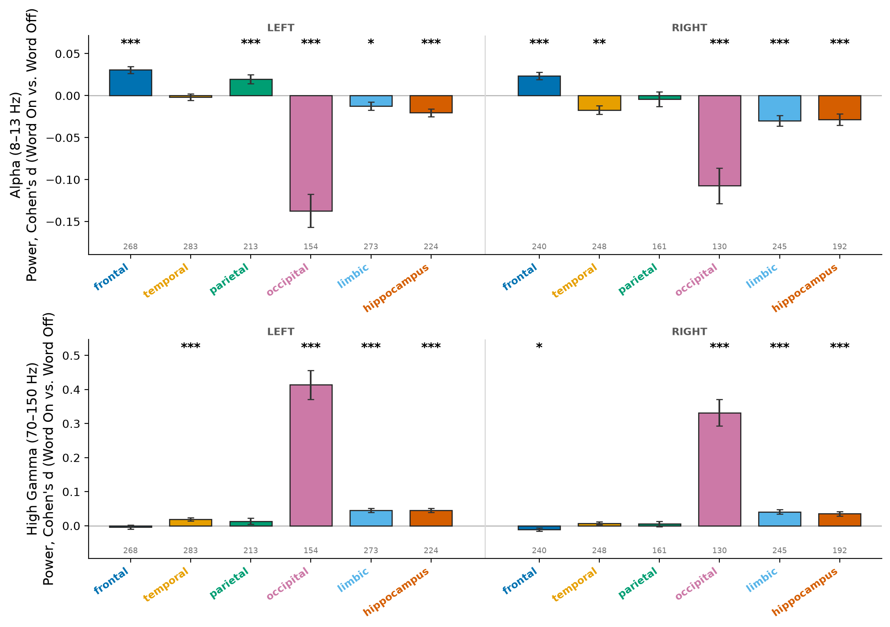
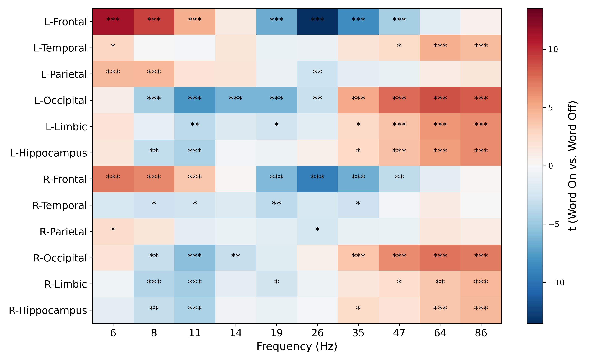
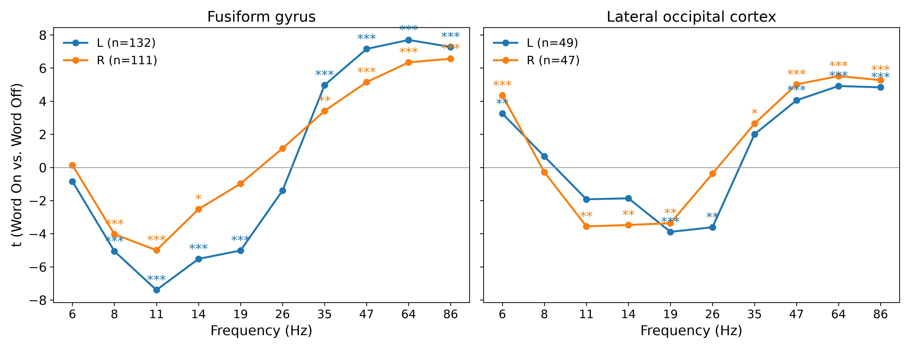
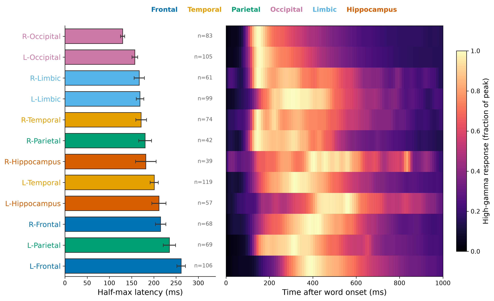
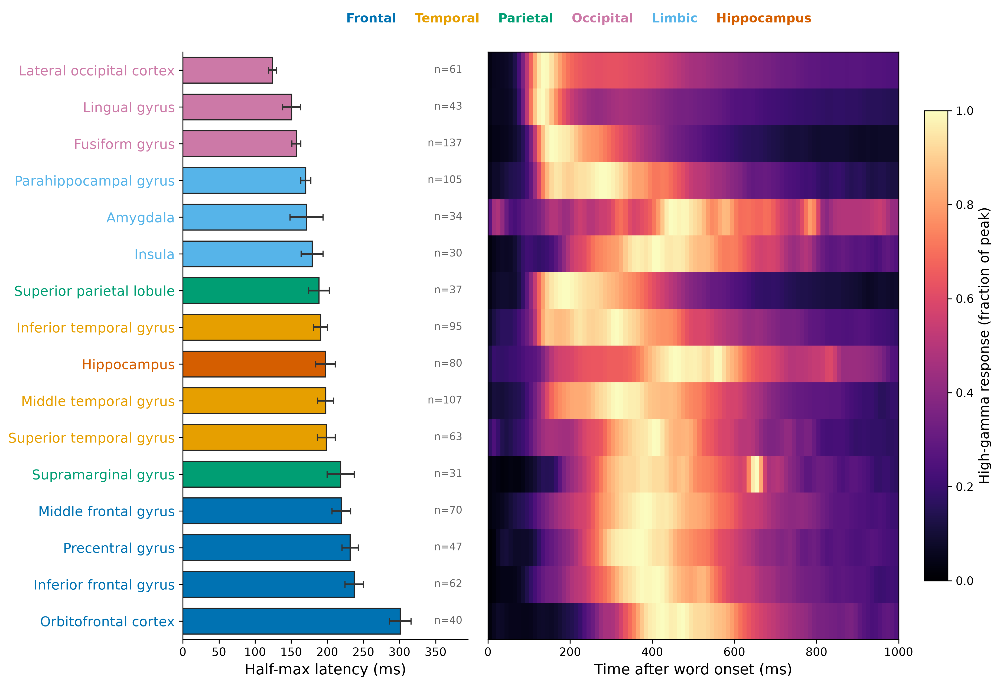
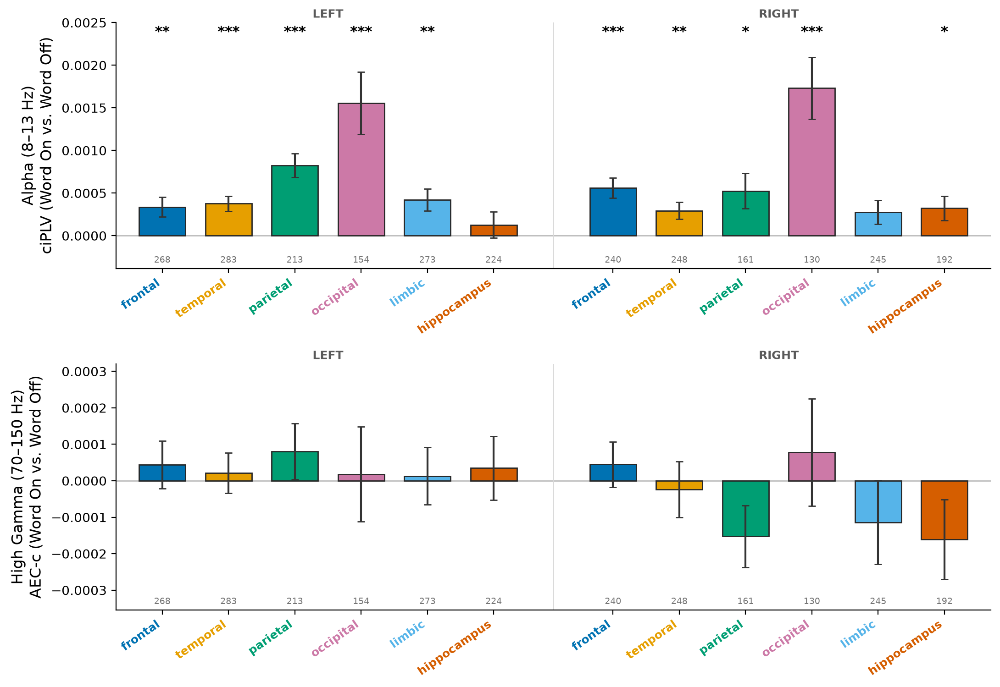
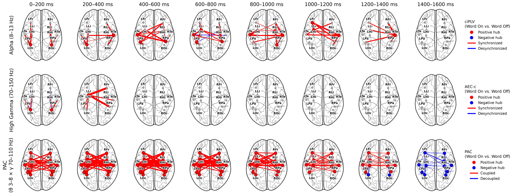
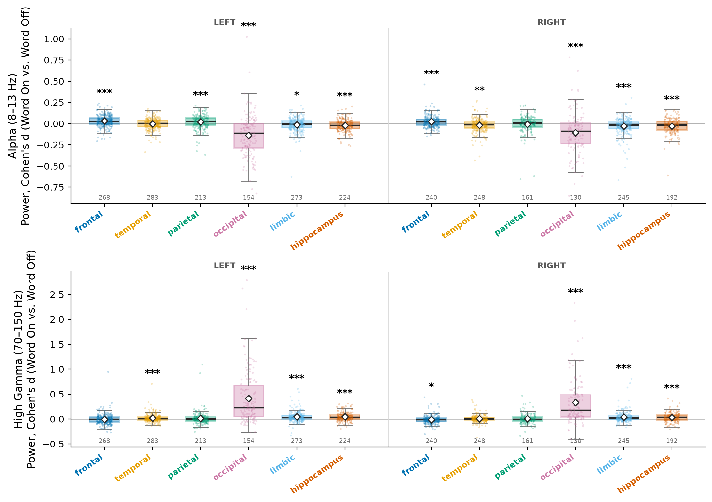
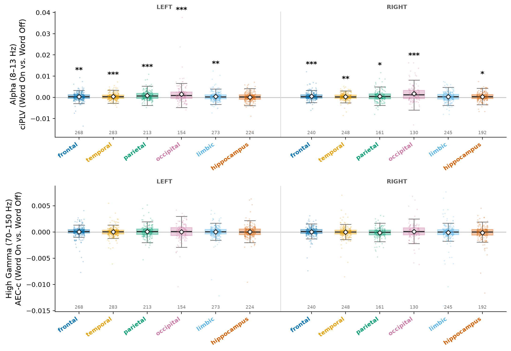
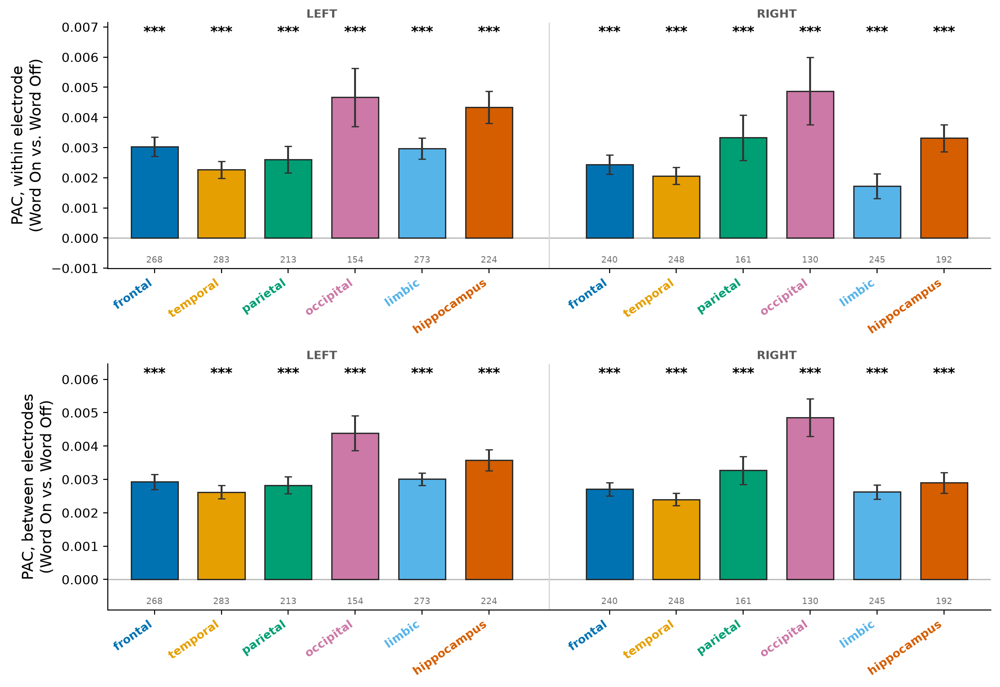

# Neural Correlates of Word onset response in human iEEG - draft 
Working notes. Figures refresh with `zsh paper/sync_figures.sh` after replotting.
Values from the 2026-10-06/08 runs (1009 sessions); **(verify)** = check before writing.

## Methods

### Data and cohort
- OpenNeuro BIDS releases of the RAM / Penn free-recall data (FR1, catFR1) and pyFR, bipolar montage. OpenNeuro ds004789 (FR1), ds004809 (catFR1), ds004865 (pyFR).
- 362 subjects, 1009 sessions: FR1 232 subj / 466 sess, catFR1 212 / 465, pyFR 38 / 78.
- Exclusions: missing / < 499 Hz sampling rate, denylist / manual, mains-harmonic peak > 5× its neighbours at a non-notched frequency (9 sessions, all 100 Hz peaks at 60 Hz sites).
- Contrast: **word on** (0–600 ms after word onset) vs **word off** (−700 to −100 ms, the blank screen before the same word). Words on screen 1600 s; blank between words ~750-1250 ms.

### Preprocessing
- Word-off and word-on clips loaded separately per word, each with 500 ms of real data buffer on both sides.
- Resampled to 500 Hz, notch 60 Hz + 120 Hz harmonic (4th-order Butterworth, ±2 Hz); buffer cropped before every estimate.
- Why 500 ms buffer: resampling (FFT) and notching each short clip ring at its edges for > 50 ms; the ringing is simultaneous across channels and biased amplitude-correlation and PAC measures. No effect on multitaper alpha (Supplement)

### Electrode localization
- Bipolar pairs labelled by lab localization default (depth: volumetric; grid/strip: surface).
- 12 Burke ROIs: frontal, temporal, parietal, occipital, limbic, hippocampus × hemisphere; sub regions = anatomical labels within them.

### Power
- Alpha (8–13 Hz) and 5–100 Hz spectrum: multitaper, 2 Hz bandwidth, 600 ms windows; spectrum in 10 log-spaced bins (48–52 / 58–62 Hz excluded).
- High gamma (70–150 Hz): Hilbert in 8 × 10 Hz sub-bands, each divided by its word-off mean, averaged (broadband, every frequency weighted equally).
- Per electrode: Cohen's d of per-trial power, word on vs word off.

### High-gamma latency
- Responsive electrodes: per-trial high-gamma power word on > word off (one-tailed Welch t test, BH-FDR within session): 5004 of 122,339 electrode-sessions, 293 subjects.
- Latency: trial-mean envelope minus word-off mean, 30 ms smoothing, first time it reaches half its peak within 0–800 ms (half-maximum).
- Subject median per region → mean ± SEM across subjects; 12 ROIs and subregions (hemispheres pooled).

### Synchrony
- Alpha: ciPLV (MNE `spectral_connectivity_epochs`, multitaper, 2 Hz bandwidth).
- High gamma: AEC-c (70–110 Hz band-pass + Hilbert, `envelope_correlation`, pairwise orthogonalized, signed, mean over trials); 70–110 Hz so the envelope stays below the band (Bedrosian).
- Pairs sharing a contact excluded. Per electrode: mean on − off change over all partners (Rao et al. 2025).

### Time-resolved network (epochs)
- 8 × 200 ms epochs (0–1600 ms), each minus the mean of three 200 ms word-off epochs.
- Region pairs with ≥ 100 subjects. Hub (Rao): a region's mean change over its connections; t across subjects; two-stage FDR (Benjamini–Krieger–Yekutieli) over region × epoch.
- Edges: each significant hub's 5 strongest connections (|mean change|), either sign; width ∝ |t| (Solomon et al. 2017 style).

### Statistics
- Sessions averaged per electrode, electrodes per subject × region (≥ 1 electrode); one-sample t vs 0 across subjects; BH-FDR within each figure / band; ≥ 30 subjects per region.

### Validation (simulations, real montages and events, signal replaced)
- Power: planted high-gamma gain recovered (≈ identity without noise), 0 elsewhere.
- ciPLV: lagged alpha coupling recovered monotonically; 0 for null, zero-lag leak, envelope plant; planted 400–800 ms coupling found only at 400–800 ms.
- AEC-c: planted shared envelope recovered (0.16 → 0.39 → 0.59 with depth); non-target pairs 0; zero-lag leak rejected; timing correct.
- Spectrum: 60 Hz notch ringing at clip edges (resolved with the 500 ms buffer; 64 Hz bin now unbiased).

## Results

### 1. Power changes at word onset

- Alpha: decrease in occipital (L −0.14, R −0.11 d), smaller decreases in limbic, hippocampus, R temporal; increase in frontal (L +0.031, R +0.024) and L parietal (+0.020).
- High gamma: large increase in occipital (L +0.41, R +0.33 d); smaller increases in limbic (+0.04), hippocampus (+0.04), L temporal (+0.02); slight decrease R frontal (−0.011).

#### Spectral profile

- Frontal: theta/low-alpha increase (t up to 11) with beta decrease (t to −13.5).
- Occipital: alpha–beta decrease (10.6 Hz t ≈ −8), broadband increase ≥ 35 Hz (t up to 8.6).
- Limbic / hippocampus: mild alpha decrease, gamma increase.
- Case studies: fusiform and lateral occipital cortex, L/R.

### 2. Order of activation

- Posterior → anterior: R occipital 130 ms, L occipital 157 → limbic, R temporal (~167–171) → R parietal, R hippocampus (~180) → L temporal 201, L hippocampus 212, R frontal 215 → L parietal 235, L frontal 261 ms.
- Subregions: lateral occipital 124 → lingual 151, fusiform 157 → parahippocampal 170, amygdala 171 → … temporal gyri ~191–199, hippocampus 197 → frontal gyri 219–237 → orbitofrontal 301 ms.
- Early regions: sharp peak ~150 ms; hippocampus / insula / frontal: broad peaks ~350–550 ms.

### 3. Synchrony

- Alpha ciPLV increases in 10 / 12 ROIs, about twice as much in occipital (~0.0016) as elsewhere (~0.0003–0.0008).
- High-gamma AEC-c: no significant change in any ROI.

#### Time-resolved network

- Alpha: 19 hub × epoch cells; occipital hubs at 0–400 ms, then temporal / parietal / limbic 200–1200 ms
- High gamma: 3 hubs (bilateral occipital 0-200 ms, L limbic 200–400 ms); no late desynchronization.
- PAC: brain-wide positive hubs 0–1200 ms (93 hub × epoch cells; fine 174), strongest 200–600 ms, negative at 1400–1600 ms; within-electrode PAC peaks 200–400 ms (occipital largest, ~0.06). Matches the trial-shuffle result → stimulus-locked (evoked), not coupling.

## Supplementary

## Limitations / discussion
- Word-off baseline starts ~80-410 ms after the previous word's offset: possible offset response / anticipation in the baseline (ISI-split check possible with stored per-trial power and blank durations).
- No ERP subtraction: evoked activity contributes to power and synchrony, especially occipital.
- Neighbour-transferred labels (~11% / 21% disagreement in LOSO).
- High-gamma phase metrics avoided (broadband HFA has no meaningful phase); AEC-c null is consistent with high gamma being local and asynchronous (Solomon et al. 2017, 2019).
- Multiple comparisons corrected within figures, not across.

## Still to do
- Reliability analysis (test–retest across sessions, within- vs between-subject identifiability). see TODO.md.
- Latency: pairwise tests 
